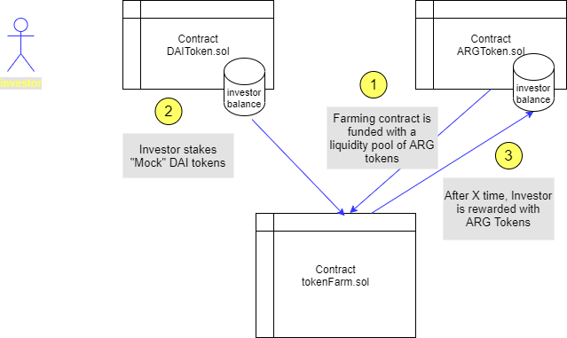
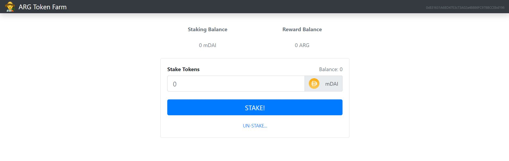

# DeFi farming example

## Overview
This project implements a DeFi application consisting of a "Farming contract" that issues new ARG coins 
to investors that deposit money for a certain amount of time



## Web APP view



## Install

Clone repository and install dependencies and devDependencies:

```bash
$ npm install -g truffle
$ npm install -g ganache-cli
$ cd DeFi_example
$ npm init
$ npm install
```

## Usage

Start ganache-cli development ethereum network:
```bash
$ ganache-cli &
```

On another terminal, compile and deploy solidity contracts to Ganache development network:
```bash
$ truffle compile
$ truffle migrate
```

On another terminal, start the web server:
```bash
$ npm run start
```

To use the Web DeFi APP go to http://localhost:3000/ in your browser

To simulate the issuing of ARG tokens run the script:

```bash
$ truffle exec ./scripts/issue-token.js
```

## Dependencies

You will need to install MetaMask in your browser in order to interact with the React Web App!!

